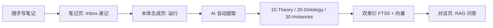

<div align="center">

# 个人企业世界模型

### Personal Enterprise World Model (PEWM)

**你只管往 `00-Inbox/` 里丢东西，剩下的交给 AI 管线。**

[](https://www.python.org/)
[](LICENSE)
[]()
[]()

[快速开始](#-快速开始) · [功能特性](#-功能特性) · [架构设计](#-架构设计) · [配置指南](#-配置指南) · [常见问题](#-常见问题)

</div>

---

##  项目简介

**个人企业世界模型**是一款**纯本地、声明式、AI 自动维护**的个人知识系统。它的核心理念是：

> 用户只负责**原始信息的采集**（随手记、会议记录、图片、语音转文字），AI 负责**结构化提取、索引、关联、问答**。

整个系统跑在你的笔记本上，不依赖任何云端服务（除非你主动配置 LLM API 启用 RAG 问答），所有数据都在本地，随时可以 `Ctrl+C / Ctrl+V` 整文件夹迁移。

**解决的痛点**：

- 笔记软件越用越多，搜不到想要的内容
- 知识散落在多个 app（印象笔记/Notion/Obsidian/微信收藏）无法联动
- 想有自己的 AI 助手，但公有云方案既贵又泄露隐私
- 传统 RAG 方案部署复杂（Docker/向量库/后端/前端）

---

##  功能特性

| 功能 | 说明 |
|------|------|
| **Inbox 速记** | 任意格式的随手记（文字/图片/代码），零格式要求，支持 `.md` / `.txt` |
| **LLM 智能提取** | 用大模型分析笔记，自动拆分成 7 种实体类型；无 Key 时可用 `--offline` 规则模式 |
| **实体自动合并** | 同名实体按合并策略（append/union/max）累积演进，元数据存于文件 frontmatter |
| **双路检索** | SQLite FTS5（BM25）关键词检索 + bge 语义向量检索，RRF 混合召回 |
| **RAG 问答** | 基于知识库的生成式问答，自动注入用户身份上下文，支持 SSE 流式输出 |
| **OCR 识别** | 本地 PaddleOCR 2.x 或云端 API（百度/腾讯/阿里） |
| **文档管理** | 软删除/硬删除/恢复，源文件丢失自动进回收站，知识永不意外丢失 |
| **文件监听** | Inbox 变更自动触发管线（防抖 + 防重入） |
| **配置迁移** | API Key / 用户身份 / AI 提示词 一键导出/导入/备份/恢复（默认脱敏） |
| **双击即用** | 单文件 `.exe`（Windows），内置 Python 运行时 + bge 模型 |
| **安全加固** | 本地 API 随机令牌鉴权 + Host 校验 + JSON-only POST，防 DNS 重绑定与 CSRF |
| **统一日志** | 控制台 + 文件双通道，按天轮转保留 7 天，关键路径性能埋点 |
| **崩溃日志** | 未捕获异常（含后台线程）自动写入 `logs/crashes/`，可选匿名上报开关 |
| **诊断面板** | 设置页实时查看 torch 状态、崩溃日志、性能指标 |

---

##  架构设计

### 知识分层

```
┌─────────────────────────────────────────────────────────┐
│  00-Inbox       你负责：原始信息采集（随手记/图片/截图） │
└─────────────────────┬───────────────────────────────────┘
                      │ AI 管线自动提取
┌─────────────────────▼───────────────────────────────────┐
│  10-Theory      行业通用知识、笔记原文存档（notes/）     │
│  20-Ontology    业务本体：术语/流程/系统/组织            │
│  30-Instances   实例：常量/案例/数据画像                 │
│  40-Skills      可执行技能：提示词/脚本/检查清单         │
└─────────────────────┬───────────────────────────────────┘
                      │ 双索引
┌─────────────────────▼───────────────────────────────────┐
│  data/                                                   │
│   ├── world-model.db   SQLite + FTS5 全文索引（WAL）     │
│   └── vector/          bge-small-zh 语义向量索引         │
└─────────────────────┬───────────────────────────────────┘
                      │ 检索
┌─────────────────────▼───────────────────────────────────┐
│  RAG Pipeline    双路召回 → 注入用户上下文 → LLM 生成   │
└─────────────────────────────────────────────────────────┘
```

### 7 种实体类型

| 类型 | 目录 | 用途 | 示例 |
|------|------|------|------|
| `term` | `20-Ontology/dictionary/` | 术语/概念 | RAG、知识图谱 |
| `process` | `20-Ontology/processes/` | 业务流程 | 订单退款流程 |
| `system` | `20-Ontology/systems/` | 系统/平台 | SAP、EPM |
| `constant` | `30-Instances/constants/` | 数值常量 | 超时时间=30分钟 |
| `case` | `30-Instances/cases/` | 案例/故障 | 订单服务 OOM 故障 |
| `skill` | `40-Skills/` | 可执行技能 | 代码审查检查清单 |
| `note` | `10-Theory/notes/` | 原文存档（兜底） | 杂记、无结构化内容 |

**提取策略**：LLM 优先分析 → 失败回退关键词触发 → 再失败整篇存为 `note`（**永远不丢**）。超过 6000 字符的长笔记在提取实体之外会自动追加整篇 note 保留全文。

**合并策略**：实体文件头部带 YAML frontmatter（type/aliases/source/created_at 等元数据），同名实体再次提取时按 `merge-policy.yaml` 声明的策略合并（definition 追加、aliases 取并集、confidence 取最大），历史积累与人工编辑不会被覆盖。

### 技术栈

| 组件 | 选型 | 用途 |
|------|------|------|
| 桌面壳 | `pywebview + Flask` | 本地桌面界面（内嵌 Web UI） |
| 数据库 | `SQLite + FTS5`（WAL 模式） | 全文索引 + 向量索引存储 |
| 向量模型 | `bge-small-zh-v1.5` | 中文语义向量（512 维） |
| 推理框架 | `sentence-transformers + torch` | 模型加载与向量生成（失败回退 TF-IDF） |
| LLM API | `openai` SDK | DeepSeek/Kimi/MiniMax 统一接口 |
| OCR 本地 | `PaddleOCR 2.x`（可选） | 高精度中文识别 |
| OCR 云端 | `baidu-aip` / `tencentcloud-sdk` | 每月免费额度 |
| 文件监听 | `watchdog` | Inbox 变更自动触发管线 |
| 打包 | `PyInstaller` | 单文件 exe |

---

##  快速开始

### 方式一：下载 exe（推荐）

1. 前往 [Releases](https://github.com/111acge/personal-word-onto/releases) 下载最新 `个人企业世界模型.exe`
2. 放到任意目录（例如桌面，注意需有写入权限）
3. 双击运行，等待启动画面完成初始化（首次需要解压 + 加载 torch）
4. 在「设置 → API 配置」填入 LLM Key（可选，启用 RAG 问答）
5. 在「笔记」写第一篇速记 → 到「本体生成」点运行 → 去「对话」开始问答

### 方式二：源码运行

```bash
# 1. 克隆仓库（需要 Git LFS，否则 bge 模型只是指针文件）
git lfs install
git clone https://github.com/111acge/personal-word-onto.git
cd personal-word-onto
git lfs pull

# 2. 创建虚拟环境（推荐 Python 3.11+）
python -m venv .venv
.venv\Scripts\activate        # Windows
# source .venv/bin/activate   # Linux/macOS

# 3. 安装依赖
pip install -r requirements.txt

# 4. 启动桌面界面
python start.py
```

### 方式三：仅命令行（无界面）

```bash
# 运行 AI 管线（处理 Inbox + 提取 + 索引）
python start.py --pipeline

# 离线模式（无 LLM Key，规则提取 + note 兜底）
python run.py --offline

# 语义检索
python 90-Meta/query/search.py "订单支付超时多久"

# RAG 问答
python 90-Meta/query/chat.py "我处理过什么故障"
```

---

##  配置指南

所有配置存放在用户目录 `~/.enterprise_world_model/`，与知识库数据分离，可独立备份迁移。

### 1. LLM API（RAG 问答必需）

在「**设置 → API 配置**」中填写。三家提供商都走 OpenAI 兼容协议，只换 base_url：

| 提供商 | Base URL | 推荐模型 | 注册链接 |
|--------|----------|----------|---------|
| DeepSeek | `https://api.deepseek.com` | `deepseek-chat` | [注册](https://platform.deepseek.com/) |
| Kimi | `https://api.moonshot.cn/v1` | `moonshot-v1-8k` | [注册](https://platform.moonshot.cn/) |
| MiniMax | `https://api.minimax.chat/v1` | `abab6.5s-chat` | [注册](https://www.minimaxi.com/) |

**成本估算**：DeepSeek 约 0.003 元/篇笔记，每月 1000 篇 ≈ 3 元。
**安全说明**：Key 仅存储在本地配置文件，界面读取时打码显示；本地 API 需要启动时生成的随机令牌才能访问。

### 2. OCR 配置（图片文字识别）

在「**设置 → OCR 配置**」切换模式（默认本地模式）：

| 模式 | 优点 | 缺点 |
|------|------|------|
| **API 模式** | exe 体积小，识别精度高 | 需要 Key（每月有免费额度） |
| **本地模式** | 离线可用 | 需要 `pip install paddlepaddle "paddleocr>=2.7.0,<3.0"`（+450MB） |

> 注意：PaddleOCR 必须安装 **2.x**（3.x 初始化参数不兼容）。

API 提供商：

| 提供商 | 免费额度 | 所需凭证 |
|--------|---------|---------|
| 百度智能云 | 每月 1000 次 | API Key + Secret Key |
| 腾讯云 | 每月 1000 次 | SecretId + SecretKey |
| 阿里云 | 按量付费 | AppCode |

### 3. 用户信息（注入到 AI 提示词）

在「**设置 → 用户信息**」填写个人/公司信息。AI 问答时会自动注入作为上下文，让回答更贴合你的身份。

### 4. AI 提示词（可定制）

在「**设置 → AI 提示词**」可编辑 3 个模板：

| 模板 | 用途 |
|------|------|
| **RAG 系统提示词** | AI 回答问题的全局指令，包含 `{{USER_CONTEXT}}` 占位符（自动替换为用户身份） |
| **无结果回复** | 知识库检索为空时的回复文本 |
| **欢迎语** | 启动时对话区显示的第一句话 |

### 5. 诊断信息（torch / 崩溃日志 / 性能指标）

在「**设置 → 诊断**」可查看：

| 面板 | 内容 |
|------|------|
| **torch 环境状态** | torch 版本、CUDA/CPU 后端、bge 模型完整性（启动期验证并缓存，可手动刷新） |
| **崩溃日志** | 匿名上报开关（默认关闭）、最近崩溃记录（含完整堆栈，含后台线程异常） |
| **性能指标** | 最近埋点（启动耗时、检索耗时、RAG 耗时等） |

崩溃日志写入 `logs/crashes/crash-*.log`，应用日志写入 `logs/app.log`（按天轮转保留 7 天）。

### 开发与测试

```bash
# 后端测试（179 项用例）
pip install pytest pytest-cov
pytest tests/ --cov=pewm

# 前端测试（Vitest + jsdom，14 项用例）
cd pewm/web/static
npm install
npm test
```

---

##  使用指南

### 典型工作流



### 桌面界面（7 个页面）

| 页面 | 功能 |
|------|------|
| **概览** | 知识库统计、快捷入口、环境状态 |
| **笔记** | Inbox 速记 + 全部笔记浏览/编辑/预览（Markdown 工具栏） |
| **对话** | 与知识库对话，支持 RAG 生成与 SSE 流式输出 |
| **检索** | 关键词/语义混合检索，查看原文 |
| **知识库文档** | 浏览/搜索/软删/硬删/恢复所有已索引文档 |
| **本体生成** | 运行 AI 管线、重建向量索引、批量 OCR、文件监听开关 |
| **设置** | API 配置 / OCR 配置 / 用户信息 / AI 提示词 / 诊断 |

> 仓库中 `pewm/gui/`（tkinter）为遗留界面，桌面端以 pywebview + Flask 为准。

### 文档管理：软删除 vs 硬删除

| 操作 | FTS5 行为 | 向量库行为 | 可恢复？ | 触发方式 |
|------|---------|----------|---------|---------|
| **软删除** | 标记 `deleted_at`，索引保留但检索过滤 | 标记 `deleted_at`，向量保留 | ✅ | 自动（源文件丢）/ 手动 |
| **硬删除** | DELETE 触发器清理 | 物理删除行 | ❌ | 手动 + 二次确认 |
| **恢复** | 清除标记即可见 | 清 `deleted_at` 标记 | - | 手动 |

**核心设计**：默认所有删除都是软删除，知识**永不意外丢失**。检索缓存随任何写操作自动失效。

### 配置导出/导入/备份/恢复

在「设置 → 用户信息」底部：

- **📤 导出全部配置**：打包成 1 个 JSON（**默认不含 API Key**；勾选包含密钥时会给出安全提醒，文件内带 `contains_api_keys` 标记）
- **📥 导入配置**：从 JSON 恢复（默认增量合并只补缺，可选覆盖模式；脱敏占位符 `***` 不会覆盖已有真实密钥）
- **💾 备份配置目录**：把整个 `~/.enterprise_world_model/` 快照到指定目录
- **♻️ 从备份恢复**：先对当前配置自动快照，再从备份目录还原

---

##  项目结构

```
personal-word-onto/
├── pewm/                         # AI 管线（核心代码）
│   ├── config/
│   │   ├── schemas/              # 7 个实体 schema（yaml，含 frontmatter 模板）
│   │   ├── extraction-rules.yaml # 关键词触发规则（离线模式）
│   │   └── merge-policy.yaml     # 冲突合并策略
│   ├── processors/               # 管线核心模块
│   │   ├── extractor.py          # LLM + 规则 混合提取
│   │   ├── merge.py              # 实体合并（frontmatter 读写）
│   │   ├── rag.py                # RAG 问答管道
│   │   ├── retrieval.py          # 双路混合召回（RRF + 缓存）
│   │   ├── vector_db.py          # 向量库（bge / TF-IDF 回退）
│   │   ├── vectorizer.py         # 双索引写入（FTS5 + 向量）
│   │   ├── database.py           # SQLite + FTS5（WAL）
│   │   ├── llm_client.py         # LLM API 适配（3 家）
│   │   ├── ocr.py + ocr_api.py   # OCR 双模式
│   │   ├── watcher.py            # Inbox 文件监听（防抖 + 防重入）
│   │   ├── user_profile.py       # 用户身份
│   │   ├── prompt_config.py      # AI 提示词
│   │   ├── config_manager.py     # 配置导出/导入/备份/恢复（原子写）
│   │   ├── crash_handler.py      # 崩溃捕获（含后台线程）
│   │   ├── log_config.py         # 统一日志
│   │   ├── metrics.py            # 性能埋点
│   │   ├── torch_validator.py    # torch 环境验证（结果缓存）
│   │   └── environment_status.py # 环境健康检查
│   ├── web/                      # 桌面 Web UI（Flask + pywebview）
│   │   ├── app.py                # 路由/API（令牌鉴权 + Host 校验）
│   │   ├── desktop.py            # pywebview 入口
│   │   ├── splash_controller.py  # 启动画面与初始化编排
│   │   ├── static/               # 前端（含 Vitest 测试）
│   │   └── templates/
│   ├── gui/                      # 遗留 tkinter 界面
│   └── prompts/
│
├── 00-Inbox/                     # 你唯一维护的目录
├── 10-Theory/                    # AI 维护：笔记存档
├── 20-Ontology/                  # AI 维护：术语/流程/系统
├── 30-Instances/                 # AI 维护：常量/案例
├── 40-Skills/                    # AI 维护：技能
├── 90-Meta/query/                # 命令行查询接口
├── bge-model/                    # 内置语义向量模型（Git LFS）
├── data/                         # 运行时数据（自动创建，不入 git）
├── tests/                        # 后端测试（179 项）
├── docs/                         # 设计/排查/修复文档
│
├── start.py                      # 启动器（桌面 / 命令行）
├── run.py                        # 管线入口
├── build.py                      # PyInstaller 打包脚本（含产物校验）
├── build.spec                    # PyInstaller 配置
├── requirements.txt
└── README.md                     # 本文件
```

---

##  命令行用法

```bash
# 运行 AI 管线（处理 Inbox + 提取 + 索引 + reconcile + 补索引）
python run.py

# 常用参数
python run.py --reset             # 重置处理标记并重建索引（同内容不重复建档）
python run.py --offline           # 离线模式：规则提取 + note 兜底（无需 LLM Key）
python run.py --skip-errors       # 跳过冲突文件继续
python run.py --no-git            # 禁用 Git 自动提交
python run.py --no-vector         # 跳过向量索引（只用 FTS5）
python run.py --no-ocr            # 跳过图片 OCR
python run.py --status            # 查看处理状态
python run.py --rebuild-vector    # 重建全部向量索引
python run.py --reconcile         # 手动软删失效记录
python run.py --purge             # 硬删所有软删记录（不可逆！）
```

---

##  打包指南

### 环境要求

- Python 3.11+（推荐 3.12）
- Git + Git LFS（**必须 `git lfs pull`，否则 bge 模型只是指针文件，打包校验会拦截**）
- Windows（Linux/macOS 未充分测试）

### 打包步骤

```bash
# 1. 安装依赖
pip install -r requirements.txt
pip install pyinstaller

# 2. 执行打包
python build.py

# 3. 产物
ls dist/
# 个人企业世界模型.exe
```

### 打包原理与隐私保护

- `build.spec` 用 `onefile` 模式，所有 Python 运行时 + 第三方库 + bge 模型打到一个 exe
- **知识目录只打包空骨架**（`build/staging/`，仅含 `.gitkeep`），你的真实笔记不会进入 exe，分发安全
- 打包前自动校验 bge 模型完整性（拒绝 Git LFS 指针文件）
- 首次启动时 PyInstaller bootloader 解压到 `%TEMP%\_MEIxxxxx`；程序实际写入的 `data/` 目录在 **exe 旁边**，不在 TEMP

### 验证打包

```bash
mkdir C:\test
copy dist\个人企业世界模型.exe C:\test\
cd C:\test
.\个人企业世界模型.exe
# 启动完成后，ls 应该看到 data/ 目录
```

---

##  常见问题

### Q1. 启动 exe 后 30 秒还没反应？

**A**：正常。PyInstaller 单文件模式需要先解压到 TEMP，然后加载 torch（约 20 秒）。第一次启动可能需要 30-60 秒，后续会快一些。启动画面会实时显示初始化进度。

### Q2. data/ 文件夹没创建？

**A**：检查 exe 所在目录是否**有写入权限**（不要放 `C:\Program Files`）。如果 exe 在桌面，`data/` 应该也在桌面旁边。

### Q3. 跑管线提示"LLM 调用失败"？

**A**：「设置 → API 配置」没填 Key，或 Key 过期了。也可以完全不配 Key：命令行用 `python run.py --offline` 走规则提取 + note 兜底，功能可用但提取质量下降。

### Q4. 向量检索精度不高？

**A**：确认语义向量已启用（`data/vector/` 存在）。首次跑管线时会自动加载 bge 模型。如果模型加载失败会回退 TF-IDF（精度下降），点「本体生成」页的「重建向量索引」可修复。

### Q5. 换电脑怎么迁移？

**A**：

- **知识库数据**：把 exe 旁边的 `data/`、`10-Theory/`、`20-Ontology/`、`30-Instances/`、`40-Skills/`、`00-Inbox/` 全部拷到新电脑
- **配置**：旧电脑「设置」里「📤 导出全部配置」→ 新电脑「📥 导入配置」（默认增量合并，不覆盖已有配置）

### Q6. exe 杀毒软件报毒？

**A**：PyInstaller 打包的 exe 常被 Windows Defender 误报。加入白名单即可。

### Q7. GitHub 推送超时？

**A**：大陆访问 `github.com` 常被 SNI 干扰。配置本地代理后推送：

```bash
git -c http.proxy=http://127.0.0.1:7890 -c https.proxy=http://127.0.0.1:7890 push
```

（7890 是 Clash 默认端口，按你实际代理端口改）

### Q8. 想自定义提取规则？

**A**：编辑 `pewm/config/extraction-rules.yaml`（离线模式的关键词触发）和 `pewm/config/schemas/*.yaml`（实体字段模板）。改完下次跑管线生效。

### Q9. 本地 Web 服务安全吗？

**A**：服务仅绑定 `127.0.0.1`，且所有 API 需要启动时生成的随机令牌（X-Token）+ Host 头校验，POST 只接受 JSON——可防 DNS 重绑定与 CSRF 攻击。API Key 在接口返回时打码。

---

##  Roadmap

- [ ] 移动端 App（iOS / Android）同步 Inbox
- [ ] 语音转文字接入（Whisper API）
- [ ] 多模态 RAG（图片理解 + 文字检索）
- [ ] 知识图谱可视化
- [ ] 团队协作（多用户共享知识库）
- [ ] 支持更多 LLM 提供商（Gemini / Claude / 通义千问）

---

## License

[MIT License](LICENSE) - 自由使用、修改、分发。

---

##  致谢

- [BAAI/bge-small-zh-v1.5](https://huggingface.co/BAAI/bge-small-zh-v1.5) - 中文语义向量模型
- [sentence-transformers](https://github.com/UKPLab/sentence-transformers) - 模型加载框架
- [pywebview](https://pywebview.flowrl.com/) - 桌面壳
- [PyInstaller](https://pyinstaller.org/) - Python 打包工具
- [DeepSeek](https://platform.deepseek.com/) / [Moonshot](https://platform.moonshot.cn/) / [MiniMax](https://www.minimaxi.com/) - LLM API 提供商

---

<div align="center">

**如果这个项目对你有帮助，请点个 ⭐ Star 支持一下！**

[报告 Bug](https://github.com/111acge/personal-word-onto/issues) · [提出建议](https://github.com/111acge/personal-word-onto/issues)

</div>
